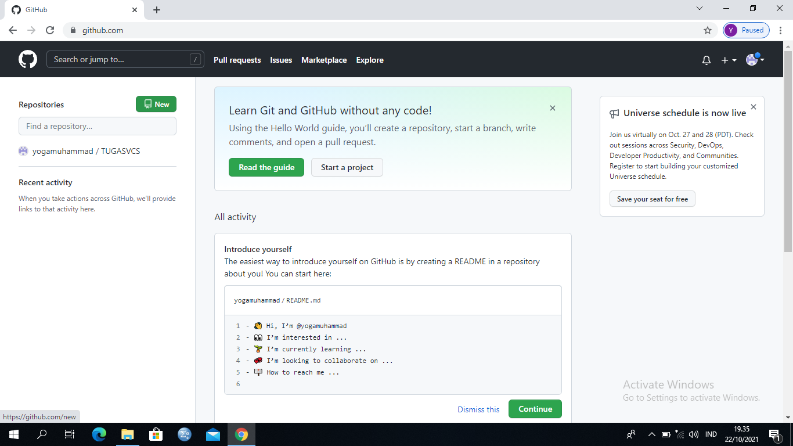

# tugasvcs

## Tutorial membuat Repository

-Buka github.com, LOGIN bila sudah terdaftar,atau SIGN UP untuk melakukan pendaftaran user github. 
-Setelah masuk pada halaman beranda github, klik new untuk pembuatan repositories.

