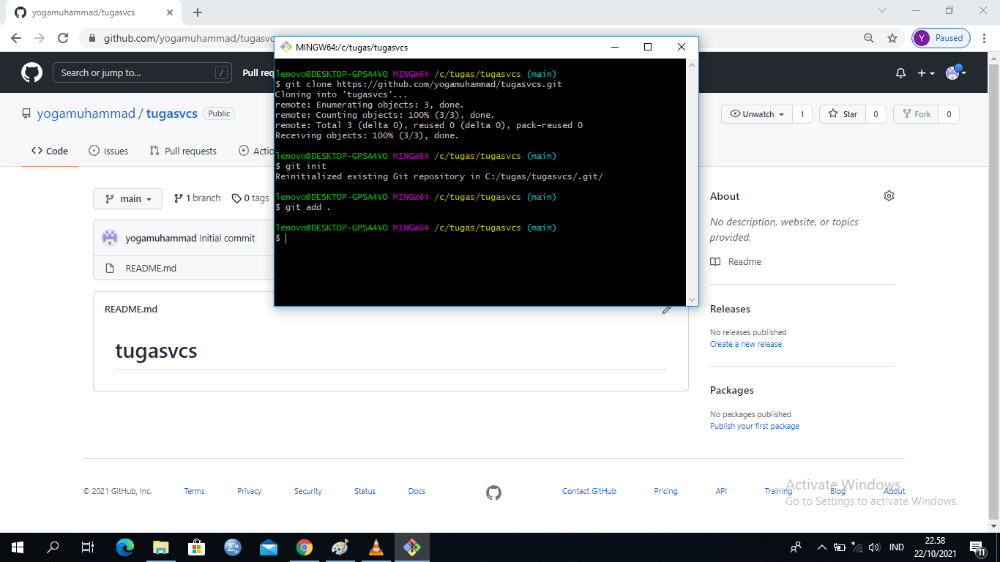
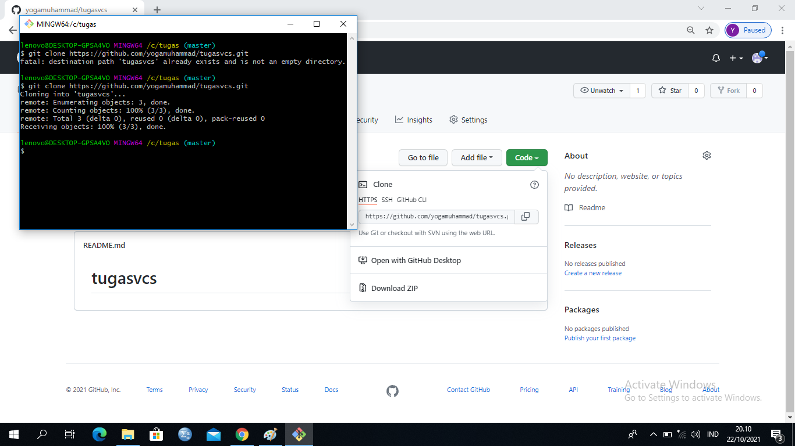
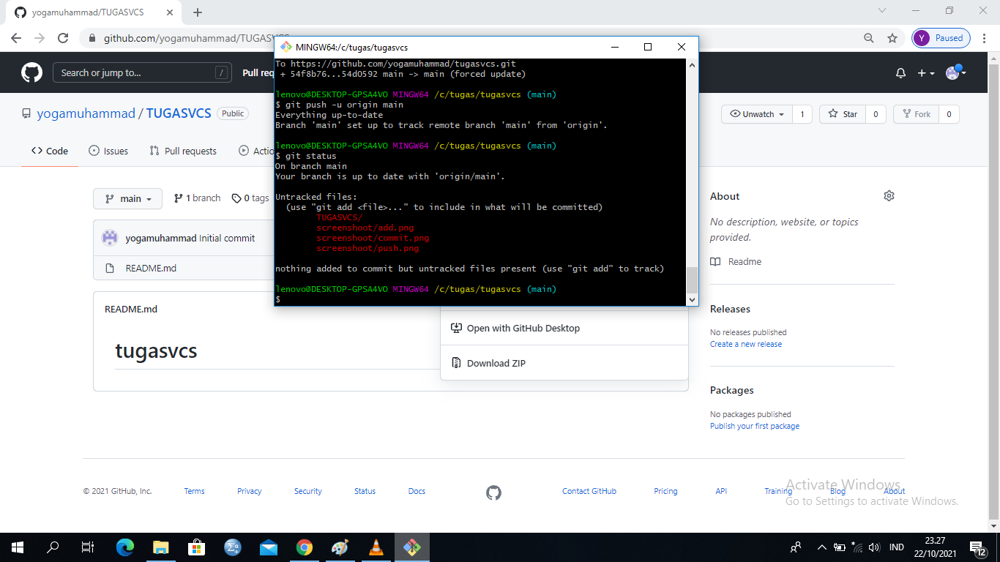
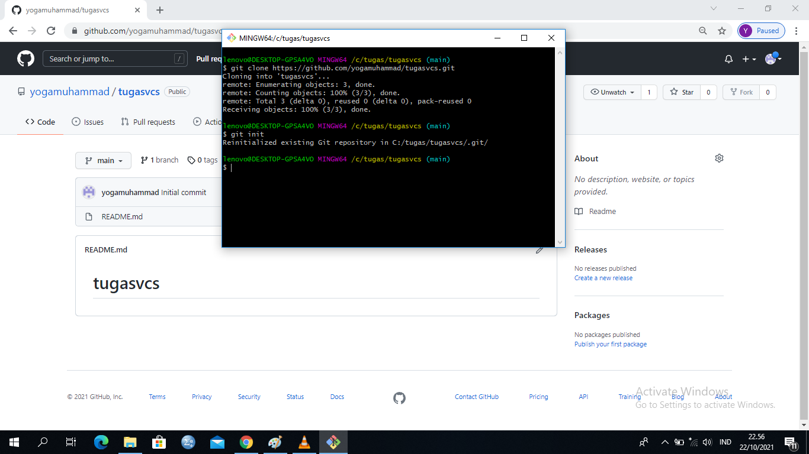
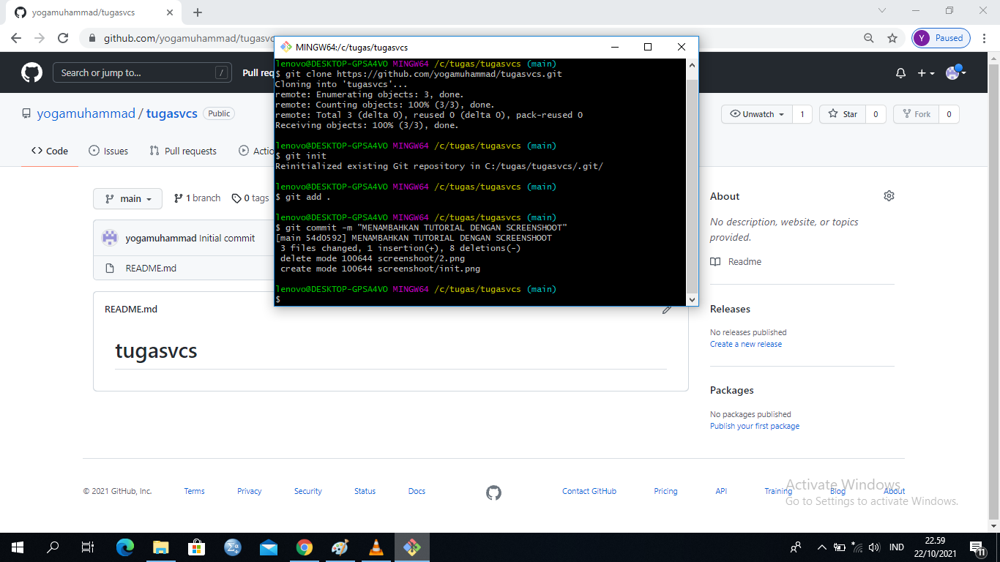
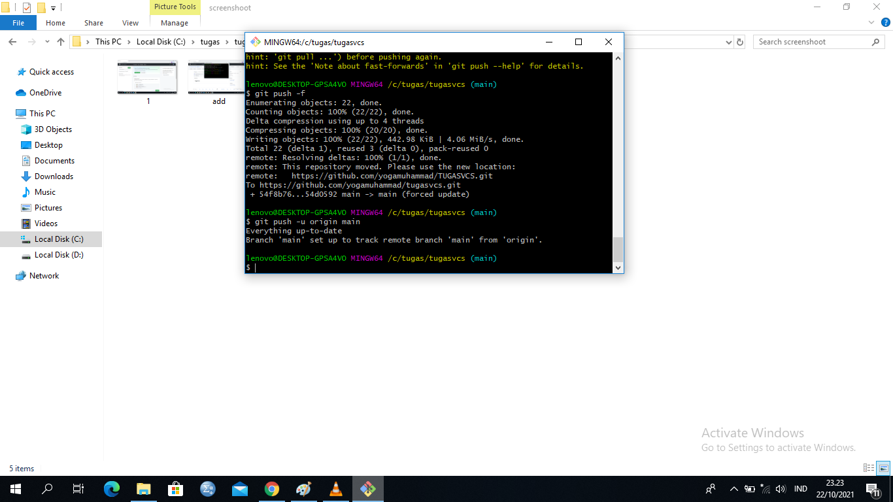

# tugasvcs

## TUTORIAL VCS

## A. Cara membuat repository pada git adalah 

## 1. Login terlebih dahulu pada website github.com, atau SIGN UP untuk daftar pengguna baru. 

## 2. Masukkan nama File repository nya, centang keterangan yang diperlukan dan klik make new repository 

## B. git add 

## adalah perintah untuk menambahkan file ke index. 

## C. git clone 

## adalah perintah untuk menyalin repository 

## D. git status 

## adalah perintah untuk menampilkan daftar file yang berubah bersama dengan file yang ingin ditambahkan atau di commit.

## E. git init 

## adalah perintah untuk membuat repository baru 

## F. git commit 

## adalah perintah untuk melakukan persetujuan pada perubahan ke head. 

## hal yang harus diingat bahwa perintah commit tidak akan langsung di remote ke repository.

## G. git push  

## adalah perintah untuk mengirimkan perubahan ke master branch dari remote repository ke direktori kerja anda. 

## Demikian sekilas tentang tutorial cara penggunaan git, terima kasih.